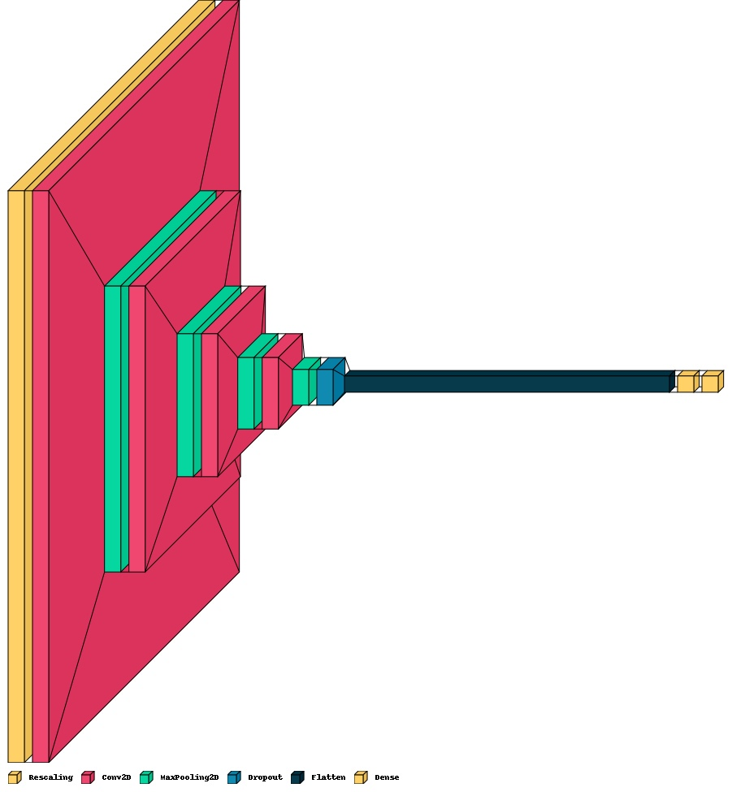
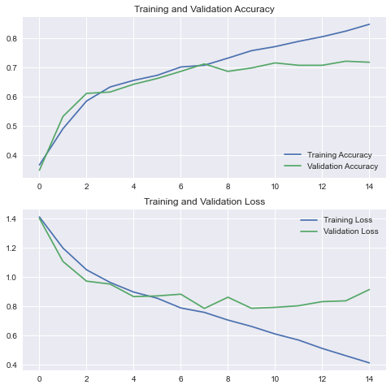

# Final-project
## Data scientist 2022

## Общие сведения  
В этом проекте решалась проблема мультиклассовой классификации цветков на 5 различных классов: роза, ромашка, одуванчик, подсолнух и тюльпан.  
Данный репозиторий содержит итоговое задание по КПП-15 Data scientist и включает в себя: 
* веса обученной модели  
* jupyter notebook с записанным процессом обучения модели  
* py-файл с примером работы с обученной моделью   

Структура спроектированной нейронной сети  
  

Графики значений функции потерь на тренировочном и валидационном наборах данных  
  
Из представленных графиков видно, что точность на тренировочных данных составила 70%

## Испоользуемые библиотеки
Для работы использовались библиотеки opencv, numpy, tensorflow, keras, pillow, matplotlib  
Более подробный список библиотек интерпретатора можно увидеть в файле requirements.txt

## Источники информации  
Для обучения модели использовался один из предложенных наборов данных  
[Просмотр использованного набора данных](https://www.kaggle.com/datasets/alxmamaev/flowers-recognition)  

## Работа с моделью  
В файле Example.py содержится пример кода с использованием спроектированной и обученной модели.  
При запуске написанного скрипта будет создано окно выбора файла, выберете изображениние цветка, далее изображение и круговая диограмма, отображающая степень уверенности модели, будут выведены на экран.